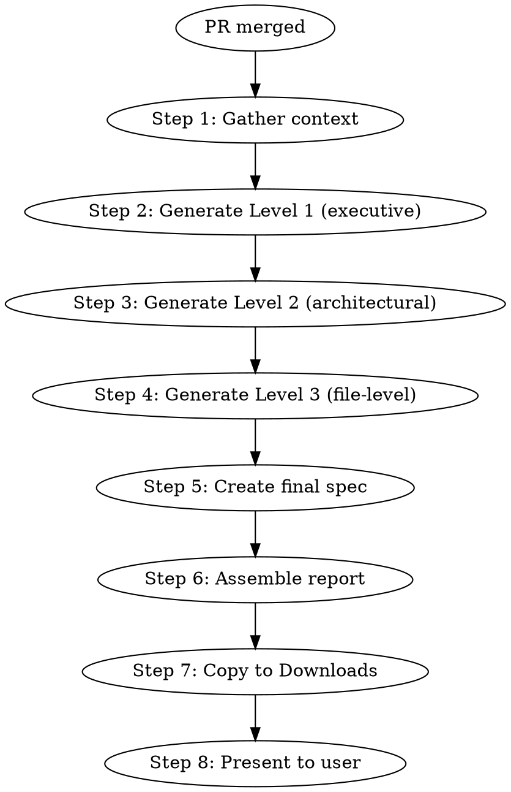

# Release Report

Generate a comprehensive, visual, shareable report of everything that changed in a merged PR. Three abstraction levels from executive overview to file-level detail. Final spec + report copied to Downloads for sharing.

## When to Use

- After `ship-gate` passes and PR is merged
- After `gstack-land-and-deploy` completes
- When asked to "summarize what shipped" or "write a release report"
- When you need a shareable document explaining the changes to someone else

## When NOT to Use

- Before merge (use `ship-gate` instead)
- For trivial changes (one-file typo fixes)

## The Process



## Step 1: Gather Context

Collect everything needed to write the report:

```bash
# Get the PR diff (all commits on the branch vs base)
git log --oneline <base>..HEAD
git diff <base>..HEAD --stat
git diff <base>..HEAD

# Read the spec file (if exists)
# docs/superpowers/specs/ or docs/design-docs/ or docs/exec-plans/

# Read the plan file (if exists)
# docs/superpowers/plans/ or docs/exec-plans/active/

# Read ship-gate results (if ship-gate ran)
# Look for the confidence dashboard output in recent conversation

# Count tests
pnpm test 2>&1 | tail -5

# Count lines changed
git diff <base>..HEAD --shortstat
```

Also read:
- `ARCHITECTURE.md` or `AGENTS.md` to understand where changes fit in the system
- Any `CONTEXT.md` from research-context (if it ran)
- The PR description (if available via `gh pr view`)

## Step 2: Level 1 — Executive Overview

**Target: 10-20 lines. Fits on one screen. Someone reads this in 30 seconds.**

Format:

```markdown
# [Feature Name] — Release Report

## What Changed (30-second version)

[2-3 sentence summary: what was built, why, key metric]

### Before → After

┌─ BEFORE ──────────────────────┐    ┌─ AFTER ───────────────────────┐
│                                │    │                                │
│  [simplified current state]    │    │  [simplified new state]        │
│                                │    │                                │
└────────────────────────────────┘    └────────────────────────────────┘

### Impact

| Metric          | Before | After  |
|-----------------|--------|--------|
| Lines of code   | X      | Y      |
| Test count      | X      | Y      |
| Files changed   | —      | N      |
| New files       | —      | N      |
| Removed files   | —      | N      |
```

**Rules for Level 1:**
- No file paths, no function names, no implementation details
- A non-technical person should understand what changed
- Focus on WHAT and WHY, not HOW
- Use before/after diagrams to show the system-level change
- One table with key metrics

## Step 3: Level 2 — Architectural Detail

**Target: 1-3 pages. Someone reads this in 5 minutes.**

Format:

```markdown
## Architecture Changes (detailed)

### System Context

[ASCII diagram showing where the change fits in the overall system.
Highlight the changed modules. Show data flow through them.]

### Module Map

NEW modules:
├── [module/path]          [what it does, 1 line]
│                          [key design decision, 1 line]
├── [module/path]          [what it does]
└── [module/path]          [what it does]

MODIFIED modules:
├── [module/path]          [what changed, 1 line]
└── [module/path]          [what changed]

REMOVED modules:
└── [module/path]          [why removed, 1 line]

### Data Flow

[ASCII diagram showing the data flow through the changed system.
Show inputs, processing stages, outputs, error paths.
Use the style from the user's example: box diagrams with
branching paths, labeled arrows, indented sub-flows.]

### Key Design Decisions

| Decision | Chosen | Why | Alternatives rejected |
|----------|--------|-----|----------------------|
| [decision] | [choice] | [reason] | [what else was considered] |
```

**Rules for Level 2:**
- File paths allowed but only at the module/directory level
- Function names only for key entry points
- ASCII diagrams are mandatory — not optional
- Show the data flow through the changed system
- Include design decisions with rationale
- A senior engineer joining the team should understand the architecture from this

## Step 4: Level 3 — File-Level Detail

**Target: full reference. Someone reads this when debugging or reviewing.**

Format:

```markdown
## File Changes (complete)

### New Files

| File | Lines | Purpose |
|------|-------|---------|
| [exact/path/to/file.ts] | N | [what it does, 1-2 sentences] |

### Modified Files

| File | Lines changed | What changed | Why |
|------|--------------|--------------|-----|
| [exact/path] | +N / -M | [specific change] | [reason] |

### Removed Files

| File | Lines | Why removed |
|------|-------|-------------|
| [exact/path] | N | [reason: dead code, replaced by X, etc.] |

### Edge Cases Covered

├── [edge case 1: what + how it's handled]
├── [edge case 2]
├── [edge case 3]
└── [edge case N]

### Compliance & Security

| Concern | Status | Details |
|---------|--------|---------|
| [GDPR / PSD2 / OWASP / etc.] | [addressed / N/A / deferred] | [how] |

### Test Coverage

| Test file | Tests | What's covered |
|-----------|-------|----------------|
| [path] | N | [areas tested] |

Total: N tests (+M new)

### Migration & Rollback

- Migration: [what migrations were added, if any]
- Rollback: [how to revert if needed]
- Breaking changes: [any, or "none"]

### Known Limitations

- [limitation 1 — what's not covered and why]
- [limitation 2]
```

**Rules for Level 3:**
- Every file path is exact
- Every edge case is listed
- Compliance implications are explicit
- Rollback path is documented
- Known limitations are honest (no hiding gaps)

## Step 5: Create Final Spec File

If a spec file already exists for this feature (`docs/superpowers/specs/*` or `docs/design-docs/*`), update it with:
- An "Implementation Status" section confirming all requirements are met
- A "Ship Date" field
- A link to the PR

If no spec exists, create one at `docs/superpowers/specs/YYYY-MM-DD-<feature>-final-spec.md` with the spec reconstructed from the implementation (reverse-engineer the requirements from the code).

## Step 6: Assemble Report

Combine all three levels into a single file:

```markdown
# [Feature Name] — Release Report

**Date:** YYYY-MM-DD
**PR:** #N (link)
**Branch:** feature/name → main
**Author:** [from git log]
**Ship Gate Confidence:** N% (if ship-gate ran)

---

## Level 1: Executive Overview
[from Step 2]

---

## Level 2: Architecture
[from Step 3]

---

## Level 3: File Detail
[from Step 4]
```

Save to: `docs/superpowers/reports/YYYY-MM-DD-<feature>-release-report.md`

Create the `docs/superpowers/reports/` directory if it doesn't exist.

## Step 7: Copy to Downloads

Copy both files to the user's Downloads folder:

```bash
# Create a directory in Downloads for this release
mkdir -p ~/Downloads/release-reports/YYYY-MM-DD-<feature>/

# Copy the report
cp docs/superpowers/reports/YYYY-MM-DD-<feature>-release-report.md \
   ~/Downloads/release-reports/YYYY-MM-DD-<feature>/

# Copy the final spec
cp docs/superpowers/specs/YYYY-MM-DD-<feature>-final-spec.md \
   ~/Downloads/release-reports/YYYY-MM-DD-<feature>/

# Confirm
echo "Release report copied to ~/Downloads/release-reports/YYYY-MM-DD-<feature>/"
ls -la ~/Downloads/release-reports/YYYY-MM-DD-<feature>/
```

## Step 8: Present to User

Show a brief summary:

```
══════════════════════════════════════════════════════════════
 RELEASE REPORT GENERATED
══════════════════════════════════════════════════════════════

 Feature:    [name]
 PR:         #N (merged)
 Confidence: N% (ship-gate)

 Files generated:
   Report:   ~/Downloads/release-reports/YYYY-MM-DD-<feature>/release-report.md
   Spec:     ~/Downloads/release-reports/YYYY-MM-DD-<feature>/final-spec.md

 Also saved to repo:
   docs/superpowers/reports/YYYY-MM-DD-<feature>-release-report.md
   docs/superpowers/specs/YYYY-MM-DD-<feature>-final-spec.md

 The report has 3 zoom levels:
   Level 1 — Executive (30 seconds)
   Level 2 — Architecture (5 minutes)
   Level 3 — File detail (full reference)

 Share the report with anyone who needs to understand what changed.
══════════════════════════════════════════════════════════════
```

## Quality Bar

The user's example (provided as reference) is the quality bar. Key properties:

1. **ASCII diagrams are mandatory** — data flow, module maps, branching paths. Not optional decoration.
2. **Tables for structured data** — edge cases, files, compliance, decisions.
3. **Tree notation for hierarchies** — `├──`, `└──`, `│` for module maps and edge case lists.
4. **Concrete numbers** — line counts, test counts, deltas, not "several" or "many."
5. **Named specifics** — exact file paths, exact function names, exact error codes.
6. **Honest limitations** — what's NOT covered is as important as what is.
7. **The summary paragraph** is dense, factual, metric-laden — not marketing copy.

## Integration

**This skill runs AFTER:**
- `ship-gate` (confidence assessment + merge)
- `gstack-ship` or `gstack-land-and-deploy` (PR creation + merge)
- `superpowers:finishing-a-development-branch` (merge decision)

**Pipeline position:**
```
ship-gate → merge PR → release-report (this skill)
```

**gstack integration (optional):**
- If `gstack-document-release` is available, invoke it BEFORE generating the report — it updates README/ARCHITECTURE/CONTRIBUTING to match what shipped. The release-report then documents the final state.
- If `gstack-health` is available, include the post-merge health score in the report header.
