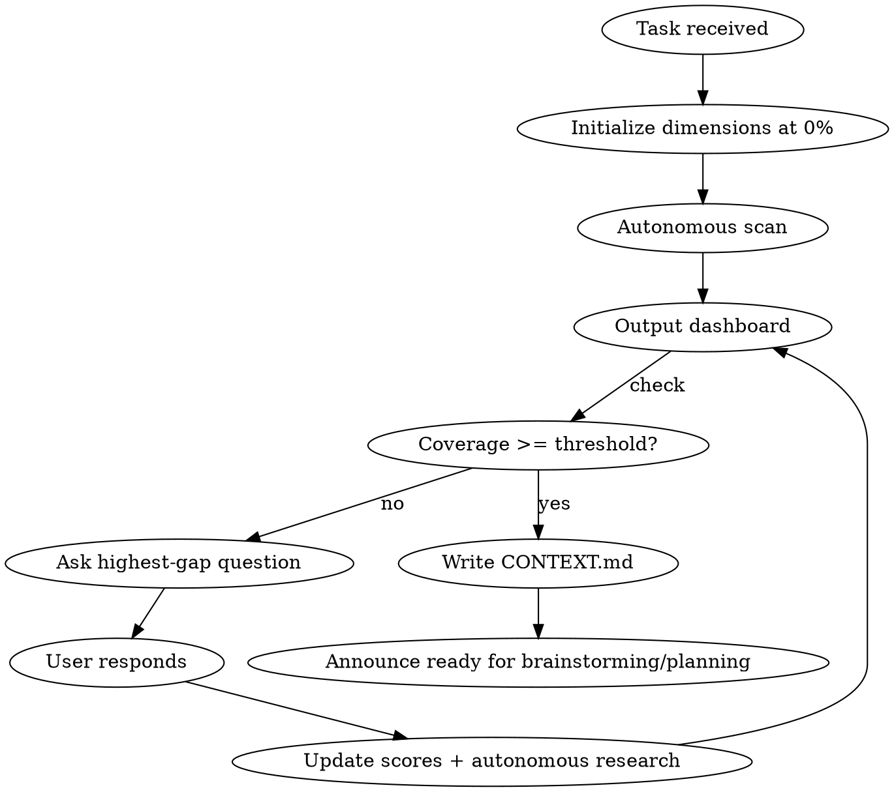

# Research Context

Systematic context gathering with visual gap tracking. Run this BEFORE brainstorming or planning.

<HARD-GATE>
Do NOT proceed to design, planning, or implementation until overall coverage reaches the threshold (default: 80%) and no dimension is below 30%. The user can override with "proceed anyway."
</HARD-GATE>

## When to Use

- Before `superpowers:brainstorming` on any non-trivial task
- Before `superpowers:writing-plans` if brainstorming was skipped
- Before any architectural decision, feature design, or refactor
- When you catch yourself thinking "I have enough context" — you probably don't

## When NOT to Use

- Typo fixes, config changes, one-line bug fixes
- User explicitly says "skip research" / "just do it"

## Process



## The 10 Dimensions

Score each 0-100% after every exchange. Use this rubric:

| Dimension | 0% | 30% | 60% | 80% | 100% |
|---|---|---|---|---|---|
| **1. Problem & Intent** | Not stated | Vague problem described | Clear problem + why it matters | Problem + why + who benefits | Problem + why + who + measurable impact |
| **2. Success Criteria** | None | "It should work" | Specific behaviors listed | Behaviors + edge cases + rollback plan | Testable acceptance criteria with metrics |
| **3. Technical Landscape** | Haven't looked | Know which app/package | Read affected files | Understand data flow + dependencies | Mapped all touched code with line refs |
| **4. Prior Art (in-repo)** | No search done | Grepped for keywords | Found similar patterns | Analyzed reusable code + gaps | File paths + line numbers + reuse plan |
| **5. Prior Art (industry)** | No research | Know the problem class name | Found 1-2 approaches | Compared 3+ approaches with trade-offs | Named frameworks/papers + why chosen |
| **6. Constraints** | Unknown | Time/tech known | + compliance/perf/cost known | + hard dependencies mapped | All constraints documented with sources |
| **7. Edge Cases & Failures** | Not discussed | Happy path only | 2-3 failure modes listed | Failure modes + recovery strategies | Exhaustive failure matrix with mitigations |
| **8. Scope Boundaries** | Undefined | Rough "what's in" | In + explicit out-of-scope list | + MVP vs full vision distinction | + deferred items with rationale |
| **9. Domain Knowledge** | None gathered | Basic terminology | Business rules understood | Regulatory/compliance implications clear | Domain expert-level understanding |
| **10. Stakeholder Context** | Unknown | Know the user persona | + UX expectations | + adjacent stakeholders mapped | Full impact analysis across user types |

## Two Types of Actions

After each exchange, take BOTH types:

### Ask the user (things only they know)
- Intent, priorities, constraints, stakeholder context, UX preferences
- One question at a time targeting the LOWEST-scoring dimension
- Multiple choice when possible

### Do yourself (things you can look up)
- **Grep/read codebase** → fills Technical Landscape, Prior Art (in-repo)
- **Read existing docs** (AGENTS.md, design-docs, ARCHITECTURE.md) → fills Domain Knowledge, Constraints
- **Web search / Nia / WebFetch** → fills Prior Art (industry)
- **Read git log** → fills Technical Landscape (recent changes)

Do autonomous research BETWEEN questions. Don't just passively wait for user input. Report what you found in the dashboard update.

## Dashboard Format

Output this after EVERY exchange (user response or autonomous research round):

```
══════════════════════════════════════════════════════════════
 CONTEXT COVERAGE                                     {N}%
 {"█" * (N/2)}{"░" * (50 - N/2)}
══════════════════════════════════════════════════════════════

 1. Problem & Intent       {bar}  {pct}%  {status}
 2. Success Criteria       {bar}  {pct}%  {status}
 3. Technical Landscape    {bar}  {pct}%  {status}
 4. Prior Art (in-repo)    {bar}  {pct}%  {status}
 5. Prior Art (industry)   {bar}  {pct}%  {status}
 6. Constraints            {bar}  {pct}%  {status}
 7. Edge Cases & Failures  {bar}  {pct}%  {status}
 8. Scope Boundaries       {bar}  {pct}%  {status}
 9. Domain Knowledge       {bar}  {pct}%  {status}
10. Stakeholder Context    {bar}  {pct}%  {status}

══════════════════════════════════════════════════════════════
 TOP GAPS                                        ACTION
──────────────────────────────────────────────────────────────
 {rank}. {dimension}  {pct}%  {what's missing + planned action}
══════════════════════════════════════════════════════════════
```

Where:
- `{bar}` = `█` chars proportional to percentage, `░` for remainder (20 chars wide)
- `{status}` = `DONE` if ≥80%, `GAP: {specific missing thing}` if <80%
- Top gaps section shows the 3 lowest dimensions with what's missing and whether the next action is "asking you" or "I'll research this"
- Overall % = average of all 10 dimensions

## Completion Gate

**Proceed when:**
- Overall coverage ≥ 80% (configurable: user can say "threshold 60%")
- No individual dimension below 30%
- User hasn't explicitly said "proceed anyway"

**On completion:**
1. Write `CONTEXT.md` to the current working directory (or plan directory if one exists)
2. CONTEXT.md structure: one section per dimension, with evidence (file paths, quotes, links)
3. Announce: "Context gathering complete at {N}%. Ready for brainstorming/planning. Invoke `superpowers:brainstorming` or `superpowers:writing-plans` to continue — CONTEXT.md will be consumed automatically."

## CONTEXT.md Structure

```markdown
# Context: {task title}

**Coverage:** {N}% | **Date:** {date} | **Commit:** {sha}

## 1. Problem & Intent
{what we're solving, why, for whom}

## 2. Success Criteria
{testable acceptance criteria}

## 3. Technical Landscape
{affected files with line refs, data flow, dependencies}

## 4. Prior Art (in-repo)
{existing patterns found, file paths, reuse opportunities}

## 5. Prior Art (industry)
{named approaches, frameworks, papers, links}

## 6. Constraints
{time, tech, compliance, cost, dependencies}

## 7. Edge Cases & Failures
{failure matrix with mitigations}

## 8. Scope Boundaries
{in-scope, out-of-scope with rationale, MVP vs full}

## 9. Domain Knowledge
{business rules, regulatory, terminology}

## 10. Stakeholder Context
{user personas, UX requirements, adjacent stakeholders}
```

## Red Flags — You're Skipping Research

| Thought | Reality |
|---------|---------|
| "I have enough context" | Check the dashboard. Is it ≥80%? No? Keep going. |
| "This is straightforward" | Straightforward tasks are where missed context hurts most. |
| "I'll research during planning" | Research BEFORE planning. Plans built on gaps produce shallow work. |
| "The user gave me everything" | Did you check the codebase? Grep for prior art? Read the docs? |
| "Let me just start brainstorming" | Brainstorming without context = brainstorming in a vacuum. |
| "I know how to solve this" | Knowing the solution ≠ understanding the context. Research anyway. |

## Integration with Other Skills

This skill outputs CONTEXT.md. Downstream skills consume it:

- **superpowers:brainstorming** — reads CONTEXT.md to skip redundant questions; Prior Art pre-fills "Explore approaches" step
- **superpowers:writing-plans** — reads CONTEXT.md to pre-fill "Prior Art" and "Alternatives Considered" TEMPLATE.md sections
- **gsd:plan-phase** — CONTEXT.md replaces the need for a separate gsd-phase-researcher run

## Initial Autonomous Scan

On first invocation, before asking ANY question, do a quick autonomous scan:

1. Read root `AGENTS.md` (or `CLAUDE.md`) — fills Constraints, Domain Knowledge partially
2. **gstack-health baseline** (optional — if `gstack-health` appears in the available skill list):
   Invoke `gstack-health` to get the project's composite quality score (0-10), per-tool results (type-check, lint, tests, dead code), and trend direction. Record in the Technical Landscape dimension.
   Example output: "Baseline health: 7.2/10 (trending up). Type-check: pass. Lint: 3 warnings. Tests: 69/69 pass."
   **Fallback** (if gstack not available): Run `pnpm type-check`, `pnpm lint`, `pnpm test` directly. Record pass/fail per tool. No composite score.
3. **gstack-learn query** (optional — if `gstack-learn` appears in the available skill list):
   Query the gstack learnings database for entries related to the current task keywords. Feed relevant learnings into the Prior Art (in-repo) and Edge Cases dimensions.
   Example: "Previous session learned: Prisma migrations on Supabase require IF NOT EXISTS guards (confidence: high)."
   **Fallback** (if gstack not available): Skip. No learnings database available.
4. Read `ARCHITECTURE.md` (if exists) — fills Technical Landscape partially
5. Read `docs/design-docs/index.md` (if exists) — fills Prior Art (in-repo) partially
6. Grep for keywords related to the task — fills Technical Landscape, Prior Art (in-repo)
7. Check `docs/exec-plans/active/` for related in-flight work
8. Check `docs/GOLDEN_PRINCIPLES.md` (if exists) for relevant constraints
9. Check git log for recent related commits

THEN output the first dashboard with whatever you found, and ask the first question.
