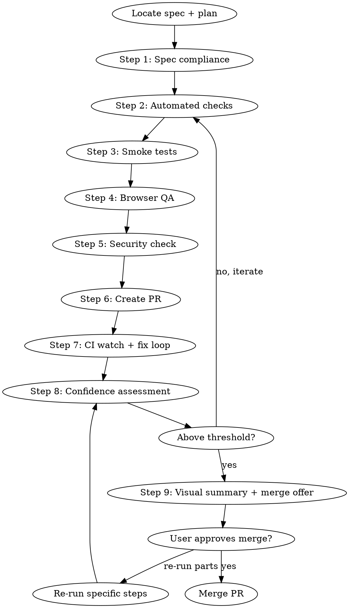

# Ship Gate

Full pre-merge verification pipeline. Verifies implementation against spec, runs every available check, generates temporary smoke tests, watches CI, loops on failures, and only offers to merge when confidence converges above threshold.

<HARD-GATE>
Do NOT merge, push to main, or claim "ready to ship" until ALL automated checks pass AND confidence is above threshold (default 80%). No exceptions. No "close enough."
</HARD-GATE>

## When to Use

- After all implementation tasks are complete
- Before merging any PR
- When `superpowers:finishing-a-development-branch` or `gstack-ship` would normally be invoked
- This skill runs FIRST, then hands off to the merge/ship skill

## When NOT to Use

- Mid-implementation (use `verification-before-completion` instead)
- For trivial changes (typo, config) — use `/ship` directly

## Prerequisites

- All changes MUST be in a **git worktree**, not the main working directory
- A spec or plan file must exist for the work being verified
- The worktree branch must be pushed (or pushable) to create a PR

## The Pipeline



## Step 1: Spec Compliance Check

Read the spec file (`docs/superpowers/specs/*` or `docs/design-docs/*`) and the plan file (`docs/superpowers/plans/*` or `docs/exec-plans/active/*`) for this feature.

For each requirement in the spec:
1. Identify the implementing code (file path + function/component)
2. Verify it exists and matches the spec's intent
3. Score: implemented / partially implemented / missing

```
SPEC COMPLIANCE
═══════════════
 Requirement 1: [description]     → [file:line]           IMPLEMENTED
 Requirement 2: [description]     → [file:line]           IMPLEMENTED
 Requirement 3: [description]     → not found              MISSING
 Requirement 4: [description]     → [file:line] partial    PARTIAL

 Score: 8/10 requirements fully implemented
 Missing: Requirement 3 (error handling for edge case X)
 Partial: Requirement 4 (missing validation on input Y)
```

**If any requirement is MISSING:** Flag it. Do NOT proceed to merge without addressing it or explicitly deferring it (with user approval + tech-debt-tracker entry).

## Step 2: Automated Checks

Run every available check. For each, record: pass/fail, output summary, duration.

**Always run (in order):**
1. `pnpm type-check` (or project equivalent)
2. `pnpm lint` (or project equivalent)
3. `pnpm test` (or project equivalent)

**If gstack available:**
4. `gstack-health` — composite quality score + trend
5. `gstack-review` — structural diff analysis (SQL safety, trust boundaries)

**If dependency-cruiser configured:**
6. `pnpm depcruise --validate` — import boundary enforcement

**Skip rule:** If a check was already run in THIS session and passed with no code changes since, skip it and note "SKIP (passed at HH:MM, no changes since)."

Record results for the dashboard.

## Step 3: Smoke Tests

Generate temporary smoke tests that exercise the implementation end-to-end within the current coding environment. These test the **computational side** — data flow, API responses, state transitions — not UX.

**Process:**
1. Read the spec's acceptance criteria
2. For each criterion that CAN be verified programmatically:
   - Generate a test file in a temp directory (e.g., `__smoke_tests__/`)
   - The test should import the actual implementation and exercise the real flow
   - No mocks unless absolutely necessary (external APIs, browser)
3. Run all smoke tests
4. Record results
5. **DELETE all smoke test files** (`rm -rf __smoke_tests__/`) — these are ephemeral, never committed

**What smoke tests cover:**
- API endpoint responses (start server, hit endpoint, check response shape)
- Service function outputs (call with realistic inputs, verify outputs)
- Database operations (if test DB available: create, read, update, delete)
- Integration between modules (data flows from A → B → C correctly)

**What smoke tests do NOT cover (flag as "manual tests needed"):**
- UI rendering and visual appearance
- User interaction flows (click, type, navigate)
- Authentication flows requiring real credentials
- Third-party API integrations requiring live keys
- Performance under load

List manual tests explicitly in the dashboard.

## Step 4: Browser QA (optional)

If `gstack-qa-only` appears in the available skill list AND the change touches frontend files:

1. Invoke `gstack-qa-only` on affected pages
2. Record health score + findings
3. Critical/high findings block merge

If `gstack-browse` is available but not `gstack-qa-only`:
1. Navigate to affected pages
2. Take screenshots
3. Check for console errors
4. Record findings

**Fallback:** Skip. Note "Browser QA: SKIPPED (gstack not available)" in dashboard.

## Step 5: Security Check (optional)

If `gstack-cso` appears in the available skill list AND the change touches auth/encryption/API/financial code:

1. Invoke `gstack-cso` in daily mode (8/10 confidence bar)
2. Record findings by severity
3. Critical findings block merge
4. High findings require user acknowledgment

**Fallback:** Skip. Note "Security: SKIPPED (gstack-cso not available)" in dashboard.

## Step 6: Create PR

If a PR doesn't already exist for this worktree branch:

1. Push the branch to remote
2. Create PR using `gh pr create`
3. Record PR URL and number

If a PR already exists, skip to Step 7.

**IMPORTANT:** All changes must be in the worktree. Verify with `git worktree list` that you're operating in the correct worktree, NOT the main working directory.

## Step 7: CI Watch + Fix Loop

Monitor CI checks on the PR:

```bash
gh pr checks <PR_NUMBER> --watch
```

**If all checks pass:** Record results, proceed to Step 8.

**If any check fails:**
1. Read the failure log: `gh pr checks <PR_NUMBER>` + check the specific failing job
2. Diagnose the root cause (read error output, not guess)
3. Fix the issue in the worktree
4. Commit the fix
5. Push
6. Re-run CI: `gh pr checks <PR_NUMBER> --watch`
7. **Loop limit: 3 fix attempts per failing check.** After 3 failures on the same check, STOP and escalate to user:
   > "CI check [name] has failed 3 times. Root causes attempted: [list]. This may need manual investigation."

Record each CI run (pass/fail, which jobs, fix attempts) for the dashboard.

## Step 8: Confidence Assessment

After all steps complete, score confidence across 10 dimensions:

| Dimension | Weight | How scored |
|---|---|---|
| Spec compliance | 20% | % of requirements implemented |
| Type safety | 10% | type-check pass = 100%, fail = 0% |
| Lint cleanliness | 5% | lint pass = 100%, warnings = 80%, errors = 0% |
| Test suite | 15% | % tests passing |
| Smoke tests | 15% | % smoke tests passing |
| Import boundaries | 5% | depcruise pass = 100%, violations = 0% |
| Browser QA | 10% | health score / 10 * 100 (or 100% if skipped with no frontend changes) |
| Security | 5% | 0 critical/high = 100%, 1 medium = 80%, critical = 0% |
| CI pipeline | 10% | all jobs pass = 100%, any fail = 0% |
| Code review | 5% | review approved = 100%, pending = 50%, rejected = 0% |

**Overall confidence = weighted average of all dimensions.**

**Threshold: 80% default.** User can override: "threshold 90%" or "threshold 70%".

**Convergence:** If confidence is below threshold, identify the lowest-scoring dimensions and suggest targeted fixes. Loop back to Step 2 with those fixes. Each iteration should increase confidence. If confidence plateaus (same score 2 iterations in a row), escalate to user.

**Manual test carve-out:** Dimensions that cannot be verified in the terminal (Browser QA when gstack unavailable, UX flows, third-party integrations) are scored at their automated best and flagged as "manual verification needed post-merge."

## Step 9: Visual Summary + Merge Offer

Output the full dashboard:

```
══════════════════════════════════════════════════════════════
 SHIP GATE                                        {overall}%
 {"█" * (overall/2)}{"░" * (50 - overall/2)}
══════════════════════════════════════════════════════════════

 STEP                      RESULT   CONFIDENCE   DETAILS
──────────────────────────────────────────────────────────────
 1. Spec Compliance        {P/F}    {pct}%       {n}/{total} requirements
 2. Type Check             {P/F}    {pct}%       {details}
 3. Lint                   {P/F}    {pct}%       {n} warnings
 4. Test Suite             {P/F}    {pct}%       {pass}/{total} tests
 5. Dep Boundaries         {P/F}    {pct}%       {details}
 6. Smoke Tests            {P/F}    {pct}%       {pass}/{total} flows
 7. Browser QA             {P/F}    {pct}%       {details or SKIPPED}
 8. Security               {P/F}    {pct}%       {details or SKIPPED}
 9. CI Pipeline            {P/F}    {pct}%       {pass}/{total} jobs
10. Code Review            {P/F}    {pct}%       {status}
──────────────────────────────────────────────────────────────

 OVERALL CONFIDENCE: {overall}%
 THRESHOLD: {threshold}%
 STATUS: {"READY TO MERGE" if overall >= threshold else "BELOW THRESHOLD"}

 ITERATIONS: {n} (confidence history: {iter1}% → {iter2}% → {iter3}%)

══════════════════════════════════════════════════════════════
 MANUAL TESTS NEEDED (cannot verify in terminal)
──────────────────────────────────────────────────────────────
 1. {description of manual test}
 2. {description of manual test}
 3. {description of manual test}
══════════════════════════════════════════════════════════════
```

**If confidence >= threshold:**

> "Ship gate passed at {overall}% confidence ({n} iterations).
> {m} manual tests remain (listed above) — verify post-merge.
>
> PR: {url}
>
> A) Merge PR now
> B) Re-run specific steps (tell me which: 1-10)
> C) Abort — I want to review manually first"

**If confidence < threshold:**

> "Ship gate at {overall}% — below {threshold}% threshold.
> Lowest dimensions: {dim1} ({pct1}%), {dim2} ({pct2}%).
>
> A) Fix and re-run (I'll target the lowest dimensions)
> B) Lower threshold to {overall - 5}% and proceed
> C) Abort — I'll investigate manually"

## Re-run Capability

When the user says "re-run step N" or "re-run parts":
- Re-execute only the specified steps
- Update the dashboard with new scores
- Recalculate overall confidence
- Present the updated summary

When the user says "re-run all":
- Full pipeline from Step 1

## Cleanup Protocol

**Before presenting the final summary, verify cleanup:**
- [ ] All smoke test files deleted (`__smoke_tests__/` removed)
- [ ] No temporary files left in the worktree
- [ ] All fix commits are clean (no "WIP" or "temp" commits — squash if needed)
- [ ] The worktree is in a clean `git status` state

**If cleanup fails:** Fix it before presenting the summary. The worktree should be pristine.

## Integration with Other Skills

**This skill replaces the manual merge decision in:**
- `superpowers:finishing-a-development-branch` — ship-gate runs BEFORE the merge options
- `gstack-ship` — ship-gate runs BEFORE gstack-ship takes over

**This skill consumes output from:**
- `superpowers:requesting-code-review` — code review status feeds dimension 10
- `gstack-health` — composite score feeds dimension 7 (or 2-6 individually)
- `gstack-cso` — security findings feed dimension 8
- `gstack-qa-only` — QA score feeds dimension 7
- `gstack-review` — structural review feeds dimension 10

**Pipeline position:**
```
implementation complete
        ↓
  ship-gate (this skill)
        ↓ (only if confidence >= threshold)
  finishing-a-development-branch OR gstack-ship
        ↓
  merge + deploy
```

## Red Flags

| Thought | Reality |
|---------|---------|
| "Tests pass, good enough" | Tests are 1 of 10 dimensions. Run the full gate. |
| "CI will catch it" | CI is step 7. Steps 1-6 catch things CI doesn't. |
| "Smoke tests are overkill" | They catch integration bugs unit tests miss. Generate, run, delete. |
| "Confidence is 75%, close enough" | Below threshold means below threshold. Fix or lower explicitly. |
| "I'll skip the security check" | If the change touches auth/crypto/financial, CSO is non-optional. |
| "The manual tests aren't important" | They're listed because automation can't verify them. Don't dismiss. |
| "Let me just merge and fix in prod" | The entire point of this skill is to prevent that. |
