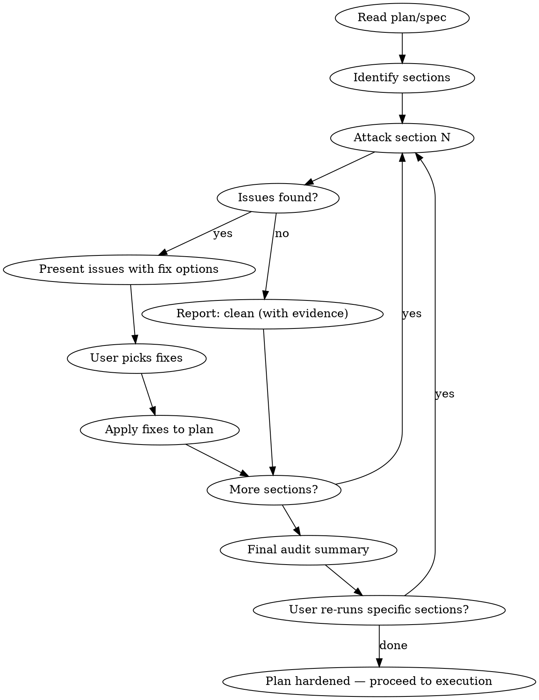

# Stress Test Plan

Adversarial section-by-section audit of a plan or spec. Finds the problems Claude's first pass missed. Every issue gets multiple fix options with a recommended choice. The plan gets hardened before a single line of code is written.

<HARD-GATE>
Do NOT skip sections. Do NOT accept "this section looks fine" without actively trying to break it. Every section gets attacked. If you genuinely find zero issues in a section, explain what you tried and why nothing broke — that itself is evidence.
</HARD-GATE>

## Why This Exists

Claude's first suggestions — even after brainstorming, research, and planning — routinely have problems: missed edge cases, wrong assumptions about existing code, race conditions, unhanded errors, security gaps, performance traps. These get discovered during implementation when they're 10x more expensive to fix. This skill finds them in the plan, where fixing is cheap (edit markdown, not refactor code).

## When to Use

- After `superpowers:writing-plans` produces an implementation plan
- After `superpowers:brainstorming` produces a design spec
- After any plan review (autoplan, eng-review) — this catches what reviews miss
- When the user says "stress test this", "find problems", "what could go wrong"
- **Recommended:** run this on EVERY non-trivial plan before execution

## When NOT to Use

- On trivial plans (1-2 tasks, single file changes)
- During implementation (use `systematic-debugging` instead)
- After implementation (use `ship-gate` instead)

## The Process



## Step 1: Read and Decompose

Read the plan or spec file. Identify every discrete section (tasks, architecture decisions, data flows, API designs, schema changes, test strategies).

List them:

```
SECTIONS TO AUDIT
═════════════════
 1. [Section/Task name]     — [1-line description]
 2. [Section/Task name]     — [1-line description]
 3. [Section/Task name]     — [1-line description]
 ...
 N. [Section/Task name]     — [1-line description]

Auditing section 1 of N...
```

## Step 2: Attack Each Section

For each section, run these 8 attack vectors. Do NOT skip any.

### Attack Vectors

| # | Vector | What you're looking for |
|---|---|---|
| 1 | **Edge cases** | What inputs/states does the plan not account for? Nulls, empty arrays, Unicode, max-length strings, negative numbers, zero, concurrent requests, duplicate entries. |
| 2 | **Error handling** | What happens when external calls fail? DB down, API timeout, malformed response, auth expired, rate limited, disk full. Does the plan handle ALL failure modes or just the happy path? |
| 3 | **Race conditions** | Can two things happen at the same time that break each other? Concurrent writes, read-then-write without locks, stale cache reads, webhook redelivery, duplicate form submissions. |
| 4 | **Wrong assumptions** | Does the plan assume something about the codebase that isn't true? Grep for the functions/files/types it references. Do they exist? Do they have the signature it assumes? Does the DB column it references actually exist in the schema? |
| 5 | **Security gaps** | Injection (SQL, XSS, command), auth bypass, privilege escalation, data exposure, missing rate limiting, secrets in logs, CORS misconfiguration. |
| 6 | **Performance traps** | N+1 queries, unbounded loops, missing pagination, loading entire tables into memory, blocking the event loop, missing indexes, re-computing what could be cached. |
| 7 | **Integration mismatches** | Does this section's output match the next section's expected input? Type mismatches, missing fields, different naming conventions, incompatible formats. |
| 8 | **Missing rollback** | If this section fails mid-execution, what state is the system in? Can you recover? Is there a migration that can't be reversed? Data that can't be un-deleted? |

### How to Attack (not just think)

**Don't just reason about what could go wrong. Actually check:**

```bash
# Vector 4 — verify assumptions
# Does the function the plan references actually exist?
grep -r "functionName" apps/api/src/

# Does the DB column exist?
grep "columnName" packages/database/prisma/schema.prisma

# Does the type have the shape the plan assumes?
grep -A 10 "interface TypeName" packages/types/src/
```

```bash
# Vector 6 — check for N+1
# Does the plan's query pattern load relations in a loop?
grep -A 5 "findMany\|findFirst" apps/api/src/services/relevant-file.ts
```

**If the plan references code that doesn't exist, that's an issue.**
**If the plan assumes a type shape that's wrong, that's an issue.**
**If the plan's SQL would scan a full table without an index, that's an issue.**

## Step 3: Present Issues Per Section

After attacking a section, present findings:

```
══════════════════════════════════════════════════════════════
 SECTION 3: "Add portfolio summary endpoint"    4 issues found
══════════════════════════════════════════════════════════════

 ISSUE 3.1 [EDGE CASE] — Empty portfolio returns 500
 ─────────────────────────────────────────────────────
 The plan calls `assets.reduce(...)` on the query result but doesn't
 handle the case where the user has zero assets. `reduce` on an empty
 array without an initial value throws TypeError.

 Severity: HIGH (will crash in production for new users)

 Options:
   A) Add initial value to reduce: `.reduce((sum, a) => sum + a.value, 0)`
      Effort: 1 line. Fixes the crash. RECOMMENDED.
   B) Add early return: `if (assets.length === 0) return { total: 0, breakdown: [] }`
      Effort: 3 lines. More explicit but slightly redundant with option A.
   C) Add a test-only guard and let the frontend handle empty state.
      Effort: 0 backend lines. Pushes complexity to frontend. NOT RECOMMENDED.

 → RECOMMENDED: A (1 line, fixes root cause)

 ─────────────────────────────────────────────────────
 ISSUE 3.2 [WRONG ASSUMPTION] — `convertAllToEUR` doesn't exist
 ─────────────────────────────────────────────────────
 The plan references `convertAllToEUR(assets)` in the service layer but
 this function doesn't exist in `apps/api/src/services/`. There IS a
 `convertToEUR(amount, currency)` that converts a single value.

 Severity: HIGH (plan references nonexistent code)

 Options:
   A) Use existing `convertToEUR` in a map: `assets.map(a => convertToEUR(a.value, a.currency))`
      Effort: 1 line change in plan. Uses what exists. RECOMMENDED.
   B) Create `convertAllToEUR` as a new helper wrapping the map.
      Effort: 5 lines new code + plan update. Adds unnecessary abstraction.
   C) Skip conversion, return raw values per currency.
      Effort: Simplifies plan but changes the spec. Requires spec approval.

 → RECOMMENDED: A (uses existing code, no new files)

 ─────────────────────────────────────────────────────
 ISSUE 3.3 [PERFORMANCE] — No index on `assets.userId`
 ─────────────────────────────────────────────────────
 The plan queries `prisma.asset.findMany({ where: { userId } })` but
 the schema doesn't have an index on `userId`. With 10K+ assets this
 becomes a full table scan.

 Severity: MEDIUM (works now, breaks at scale)

 Options:
   A) Add `@@index([userId])` to the Asset model in schema.prisma.
      Effort: 1 line + migration. RECOMMENDED.
   B) Accept the performance hit and add the index later.
      Effort: 0 now. Deferred tech debt.
   C) Add a composite index `@@index([userId, assetClass])` since the
      endpoint also filters by class.
      Effort: 1 line + migration. Over-engineers for current needs.

 → RECOMMENDED: A (1 line, prevents future problems)

 ─────────────────────────────────────────────────────
 ISSUE 3.4 [SECURITY] — No auth check on userId parameter
 ─────────────────────────────────────────────────────
 The plan takes `userId` from the route parameter but doesn't verify
 the authenticated user matches. Any authenticated user could read
 another user's portfolio.

 Severity: CRITICAL (data exposure vulnerability)

 Options:
   A) Use `request.user.id` from the auth plugin instead of route param.
      Effort: Change 1 line in plan. RECOMMENDED.
   B) Add an explicit check: `if (userId !== request.user.id) throw 403`.
      Effort: 2 lines. Works but A is cleaner.

 → RECOMMENDED: A (eliminates the attack surface entirely)

══════════════════════════════════════════════════════════════
 YOUR CHOICES (pick one per issue):
══════════════════════════════════════════════════════════════
 3.1: [A recommended] / B / C
 3.2: [A recommended] / B / C
 3.3: [A recommended] / B / C
 3.4: [A recommended] / B
══════════════════════════════════════════════════════════════
```

Wait for user to pick. Apply chosen fixes to the plan. Move to next section.

## Step 4: Final Audit Summary

After all sections are audited:

```
══════════════════════════════════════════════════════════════
 STRESS TEST COMPLETE
══════════════════════════════════════════════════════════════

 Sections audited:    N
 Total issues found:  M
 By severity:
   CRITICAL:  X  (all must be fixed before execution)
   HIGH:      X  (strongly recommended to fix)
   MEDIUM:    X  (fix now or defer with tech-debt entry)
   LOW:       X  (optional, noted for awareness)

 Issues fixed:        M-K (applied to plan)
 Issues deferred:     K   (added to tech-debt-tracker)

 SECTIONS BY STATUS:
  1. [name]     ████████████████████  CLEAN (0 issues)
  2. [name]     ████████████████░░░░  HARDENED (3 issues fixed)
  3. [name]     ████████████████████  CLEAN (0 issues, evidence: [what was checked])
  4. [name]     ██████████████░░░░░░  HARDENED (4 issues, 3 fixed, 1 deferred)

 ATTACK VECTORS COVERAGE:
  Edge cases:              ✓ checked all sections
  Error handling:          ✓ checked all sections
  Race conditions:         ✓ checked all sections
  Wrong assumptions:       ✓ verified 12 code references via grep
  Security gaps:           ✓ checked all sections
  Performance traps:       ✓ checked all sections
  Integration mismatches:  ✓ checked all section boundaries
  Missing rollback:        ✓ checked all sections

══════════════════════════════════════════════════════════════
```

## Step 5: Codex Adversarial Challenge (optional)

After the audit summary, if `gstack-codex` appears in the available skill list:

```
 CODEX ADVERSARIAL CHALLENGE
 ═══════════════════════════
 Claude just audited this plan using 8 attack vectors. But Claude
 reviewing Claude's plan has a blind spot: same model, same training
 distribution, same classes of issues it tends to miss.

 Codex uses GPT — different model, different failure modes. It will
 try to break the plan independently.

 A) Run Codex challenge on the full plan (recommended)
 B) Run Codex challenge on CRITICAL/HIGH sections only
 C) Skip
```

**If A or B:**
1. Extract the plan text (full or filtered sections)
2. Invoke `gstack-codex` in challenge mode with this prompt context:
   > "This is an implementation plan. Your job is to break it. Find edge cases, wrong assumptions, race conditions, security holes, performance traps, and integration mismatches that the plan doesn't handle. Be adversarial. For each issue, explain what breaks and suggest a fix."
3. Collect Codex's findings
4. Deduplicate against issues Claude already found (same issue from both models = high confidence it's real)
5. Present NEW issues (ones Claude missed) in the same format as Step 3:

```
══════════════════════════════════════════════════════════════
 CODEX FOUND 2 NEW ISSUES (Claude missed these)
══════════════════════════════════════════════════════════════

 ISSUE C.1 [RACE CONDITION] — Concurrent portfolio reads during write
 ─────────────────────────────────────────────────────────────
 [Codex's finding in the standard issue format with fix options]

 ISSUE C.2 [EDGE CASE] — Deleted assets still counted in summary
 ─────────────────────────────────────────────────────────────
 [Codex's finding with fix options]

══════════════════════════════════════════════════════════════
 CONFIRMED BY BOTH MODELS (high confidence):
  - Issue 3.4 (auth bypass) — Claude found it, Codex independently confirmed
══════════════════════════════════════════════════════════════
```

Wait for user to pick fixes for new issues. Apply to plan.

**If C (skip):** Proceed to re-run offer.

**Fallback** (if gstack-codex not available): Skip entirely. Note "Codex challenge: SKIPPED (not available)" in the audit summary.

## Re-run Capability

User can say:
- "re-run section 3" — re-attacks that section with fresh eyes
- "re-run security on all sections" — runs only attack vector 5 across all sections
- "re-run everything" — full audit from scratch
- "focus on section 3 and 5" — audits only those sections

Re-runs update the summary with new findings. Previously fixed issues are not re-raised unless the fix introduced a new problem.

## Integration

**Pipeline position:**
```
writing-plans → stress-test-plan (this skill) → execution
```

**This skill runs AFTER:**
- `superpowers:writing-plans` (plan is written)
- `gstack-plan-eng-review` (optional architecture review)
- `gstack-autoplan` (optional 4-role review)

**This skill runs BEFORE:**
- `superpowers:subagent-driven-development` (execution)
- `superpowers:executing-plans` (execution)

**gstack integration (optional):**
- If `gstack-codex` is available, offer Codex challenge mode on high-severity sections:
  > "Section 3 had 2 CRITICAL issues. Want Codex to adversarially attack it too? (independent AI, different blind spots)"
- If `gstack-health` is available, check current codebase health to calibrate assumption checking (if health is low, more assumptions are likely wrong)

## What Makes This Different From Plan Reviews

| This skill | Plan reviews (autoplan, eng-review) |
|---|---|
| Attacks with 8 specific vectors | Reviews holistically |
| Greps the codebase to verify assumptions | Reasons about the plan text |
| Presents multiple fix options per issue | Gives recommendations |
| Section-by-section with user choices | Full-plan with overall assessment |
| Focuses on what WILL BREAK | Focuses on what COULD BE BETTER |

Both are valuable. Run reviews first (big-picture), then stress-test (detail-level).

## Red Flags

| Thought | Reality |
|---------|---------|
| "This section looks fine" | Did you grep for the functions it references? Did you check the schema? Did you think about concurrent requests? "Looks fine" means you didn't try hard enough. |
| "The review already caught this" | Reviews and stress tests find different things. Reviews catch design issues. Stress tests catch implementation bugs hiding in the plan. |
| "This edge case is unlikely" | Unlikely edge cases cause production incidents. Flag it, let the user decide to defer. |
| "I'll catch this during implementation" | Catching it in the plan costs 1 line of markdown. Catching it during implementation costs a debug session. |
| "Too many issues will overwhelm the user" | Present by severity. CRITICALs first. The user can defer MEDIUMs and LOWs. |
| "The user already approved this plan" | Approval was based on incomplete information. New issues = new information. Present them. |
